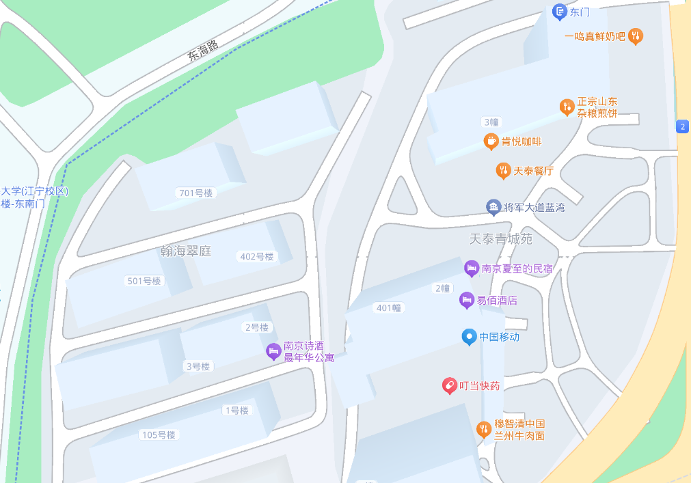

# 河海大学校外觅食指北

## 江宁校区

**江宁校区的餐馆主要集中在南门、东门**

**注：本指南具有时效性，可能有部分餐饮店会停业，也有可能新开其他店，更新不及时敬请谅解。**

### 东门

东门是地铁入口，可直达市区美食。但需要通过南京南站长长的换乘通道。也可在东门乘网约车或骑车前往5km外的托乐嘉街区，即为南航将军路校区后街，该处小吃众多，也有火锅、泸溪河、麦当劳等餐饮，此处不予详细概述。

1. **KFC**：不用多解释，V50文案相信大家或多或少见过不少。不过在某些特定时间（如疯狂星期四或联动某游戏时期）可能人比较多，有些餐会售罄。
2. **CoCo和茶百道**：无需多言。只不过茶百道有要搬走的传言。
3. **杂粮煎饼**：共有两家，见仁见智，笔者觉得不是很好吃但也不难吃。
4. **罗森便利店**：饭团可以填饱肚子，关东煮较贵，味道一般。笔者喜欢吃萝卜和豆腐。
5. **兰州牛肉面和汤包**：味道一般，价格偏高。可以尝一尝，也许会很对胃口。

### 南门 

#### 南门对面菜市场

1. **板栗鸡米饭**：神中神，炒饭量大好吃还便宜，盖浇饭可以自己加米饭。
2. **肥叔锅贴**：锅贴一般般而且又小分量又少，这家的7块钱的营养沙汤可以说是神中神，分量大又好喝
3. **金陵瘦型鸭**：待补充
4. **任家烤鸭店**：待补充
5. **王家烤鸭店**：待补充
6. **水西门瘦型鸭**：水西门算是全南京有名的烤鸭品牌了，神中神。一顿烤鸭十几块就能解决
7. **萍聚小馆**：待补充
8. **宿迁擀面皮**：待补充
9. **放心早点**：待补充
10. **麻辣香锅**：待补充
11. **淮南牛肉汤**：比较大众化的淮南牛肉汤，没有什么突出的特点，但也算不上难吃

值得一提的是这里的水果比较便宜，如果觉得学校的水果贵可以来这里买。

#### 南门往西

1. **水煮肉片**：还行，建议点羊肉或者牛肉，娃娃菜很好吃，饮料和米饭是免费畅吃的
2. **光盘小吃**：待补充
3. **土菜馆**：待补充
4. **万刘阳小吃店**：待补充
5. **喵喵自助快餐**：18一人，能吃饱但菜品数量少，味道也一般
6. **蒸全味**：待补充
7. **淮南牛肉汤馆**：待补充
8. **佛城大肉面**：待补充

这里还有很多地图上没有但味道不错的餐馆

1. **重庆小面**：汤面可以，但拌面一坨（字面意思的一坨，面都是坨住的），建议点汤面；这里还提供冰粉，口味也挺不错。
2. **古的螺蛳粉**：味道很正宗，但小贵，20左右一人。

特别表扬京东便利店，有1元一根的小布丁，性价比直接干爆学校的雪糕。

#### 南门往东

1. **小蛮螺螺蛳粉**：感觉不如古的螺蛳粉。
2. **川人川菜**：伟大，无需多言。
3. **麦苏服兰州牛肉面**：味道一般且小贵，如果想吃刀削面可以考虑
4. **华雷黄焖鸡**：口味还不错，人均价格也很便宜
5. **徐福宇黄焖鸡**：黄焖鸡还是得徐福宇
6. **味波日式料理**：口味不错，照烧鸡排饭很好吃，就是人均价格小贵
7. **西安面馆**：biangbiang面和油泼面味道非常好，也是为数不多的宽面馆，肉夹馍也很不错。
8. **我很芒**：待补充
9. **仟百味食府**：待补充
10. **傅纪正文**：待补充

地图上没有的餐馆：

1. **华莱士**：美团上两堡一卷和吉祥三堡性价比拉满
2. **九号地锅**：待补充
3. **哈尔滨水饺**：分量还可以，就是水饺的个头太小。
4. **绝味鸭脖**：鸭货中的经典
