# 新电脑的一些资源

#### 写在前面: 

​	刚步入大学，相信一台新电脑是每个人必须品了，如果你是一个小白，激活电脑后，还有什么能做的呢  ~~(下载qq，微信，steam bushi~~  

​	作为软工的助导，发现电脑小白还是很多的 ~~（有人还不会解压缩  高中只会埋头学习导致的恶果）~~   不管小白老白，都有很多没有激活office到微软账号的   

#### 笔记本到手后的验机(建议一定要做)
[验机教程](https://www.bilibili.com/video/BV15i421h7gd/?spm_id_from=333.337.search-card.all.click&vd_source=968db1d2df0d47fc166a211415e54fd0) 

#### 电脑自带资源

> 预装的office全家桶，必须在系统激活后的**6个月内**激活，否则，超期后无法激活

**如何判断是否有office**

* 如果你还记得你盒子上有

    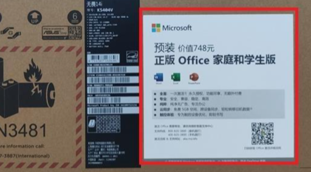

* 在网上买的话可以去看介绍
* 微软应用商店（Microsoft store) -> 库 -> 设备附带  ~~我有 但是没给我显示出来 lj~~

如果有以上三种，那么恭喜你，按照激活过程操作，你将拥有748元大礼包。如果没有也不必担心，还有[其他获取方法](####其他获取方法) ~~白嫖~~

**激活过程**

* 注册微软账号  

  * [点此进入浏览器官网进行微软账号注册](https://signup.live.com/?lic=1)

  * 或者打开office出现下面这个页面，可以直接登录注册，然后按照信息点点点，就激活了

      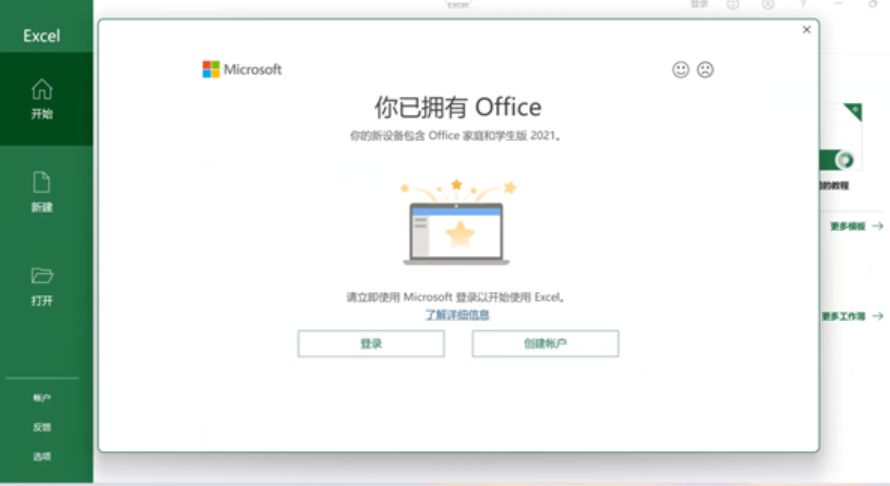        

  * 创建用户 ~~并战胜机器人后~~ 就可以获得你的第一个微软账号了  ---- > 最大的好处是在不同的电脑可以同步数据

     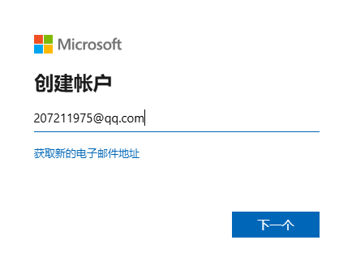          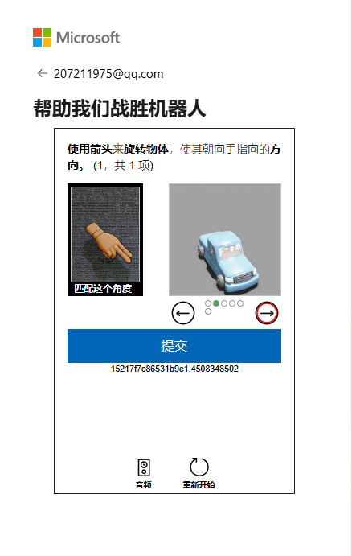

* 激活账号

  * 随便找一个office，打开左下角登录账户
  * 然后登录你刚注册的微软账号即可激活

* 激活后的页面  可以更新一下office版本

   

* 可以在官网查询信息

  [Microsoft account | 服务和订阅](https://account.microsoft.com/services/)

   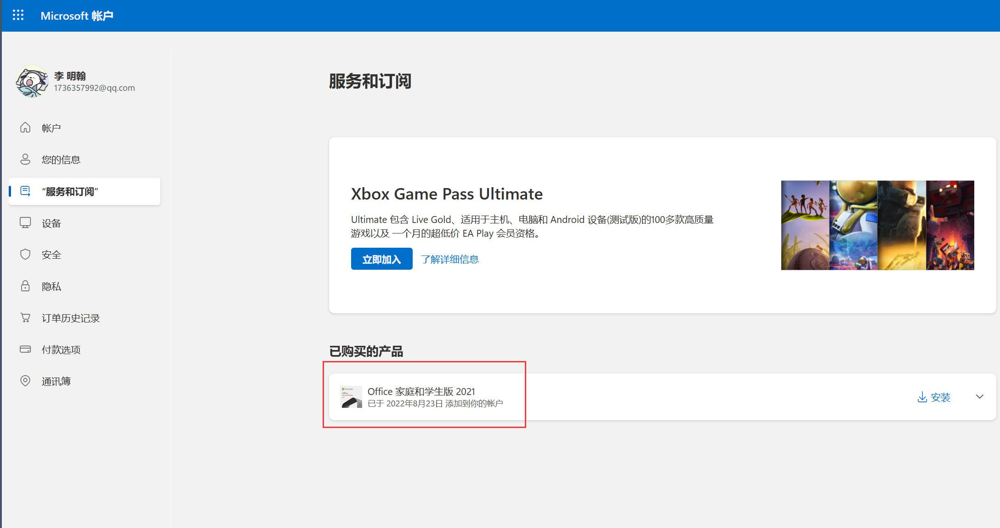

**附上几个链接**

[(23 封私信 / 80 条消息) office家庭和学生版2021是永久免费使用的嘛？ - 知乎 (zhihu.com)](https://www.zhihu.com/question/542087643/answer/3477947192)

[OFFICE家庭学生版2021激活流程（新版）-联想知识库 (lenovo.com.cn)](https://iknow.lenovo.com.cn/spider/detail/kd/200645#:~:text=打开微软应用商店 登录已注册好的微软账户，打开库，点击设备附带,可以看到设备附带中含office家庭学生版2021，点击兑换和获取 按照提示兑换成功后，打开word登录兑换的账户即可)

[预装office 2021 该怎么激活？ - 知乎 (zhihu.com)](https://zhuanlan.zhihu.com/p/390269615)

#### 过期激活

> 如果已经超过六个月了，可以先尝试上述激活，不能成功激活的话 可以按以下步骤  --  亲测一年后仍然可以激活:yum:

联系微软客服   ~~其他微软想关的都可以搜索或提问 还有很多案例~~

* 官网在线：[点此联系我们 - Microsoft 支持部门](https://support.microsoft.com/contactus?ContactUsExperienceEntryPointAssetId=S.HP.SMC-HOME)

  * 选择你需要帮助的产品（比如office、Windows等），点击“获取家庭版支持”

  * 输入您的问题后回车

  * 点击左下方"联系支持人员”

  * 选择"产品和服务”，"类别” 

     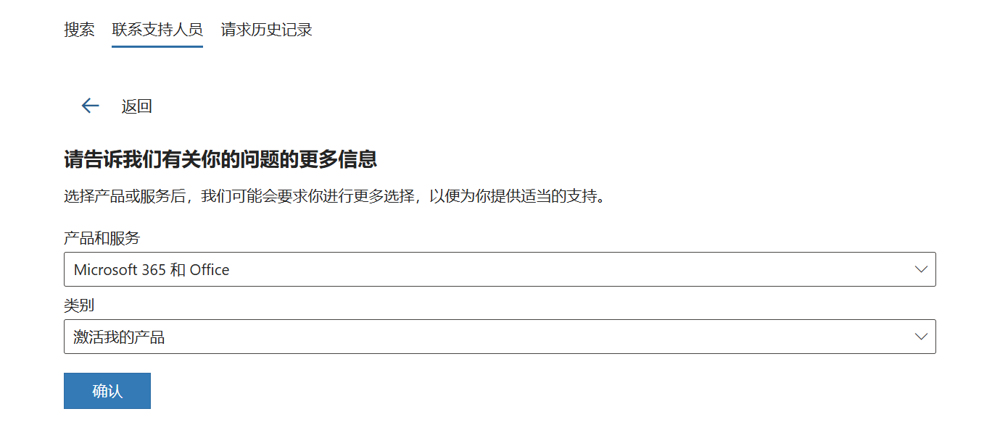

  * 进入Microsoft 支持聊天对话框（微软服务器较慢） 

     

* 客服热线：400-820-3800、或800-820-3800按语音提示进行求助。

#### 其他获取方法

如果发现没有送 ~~（点名华硕）~~，有多种选择

* **非法渠道**：用盗版 ~~微信软件园 什么的   善用百度~~

* **擦边渠道**：

   * 淘宝买激活码，也不是很贵

       

   * 永久激活神器:HEU_KMS_Activator  ~~可以自己找找 和 河海大学官网上的差不多~~

* **合法渠道**：用学校官网的资源

#### 学校官网资源

> 能激活正版Windows，office和adobe全家桶之类的，学校购买的正版软件  
>
> 官网：https://ms.hhu.edu.cn/help?articleid=815
>
> 按照网站上的步骤做就可以有正版软件，激活过office和adoba，体验很好! :heart_eyes:

 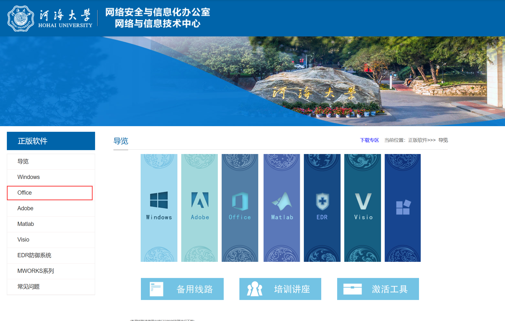

**拿office举例**

* **下载正版office**

  * 需要连接校园网 或者 河海vpn接入

  * 原本电脑其他版本的office卸载干净 ~~下面有说明~~

     

  * 点击下载 保留文件

     

  * 点进文件， 双击setup.exe安装正版office（未激活） 

     

  * 如果出现上图的提示，请先卸载原本的office， 然后再次安装即可

     

* **激活office**

  * 下载激活文件

     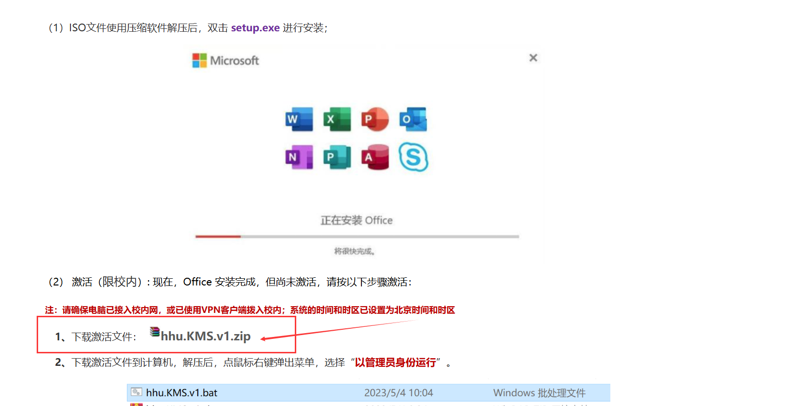

  * 同样的配方

     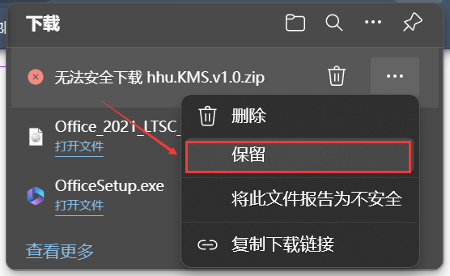

  * 右键 管理员运行bat文件

     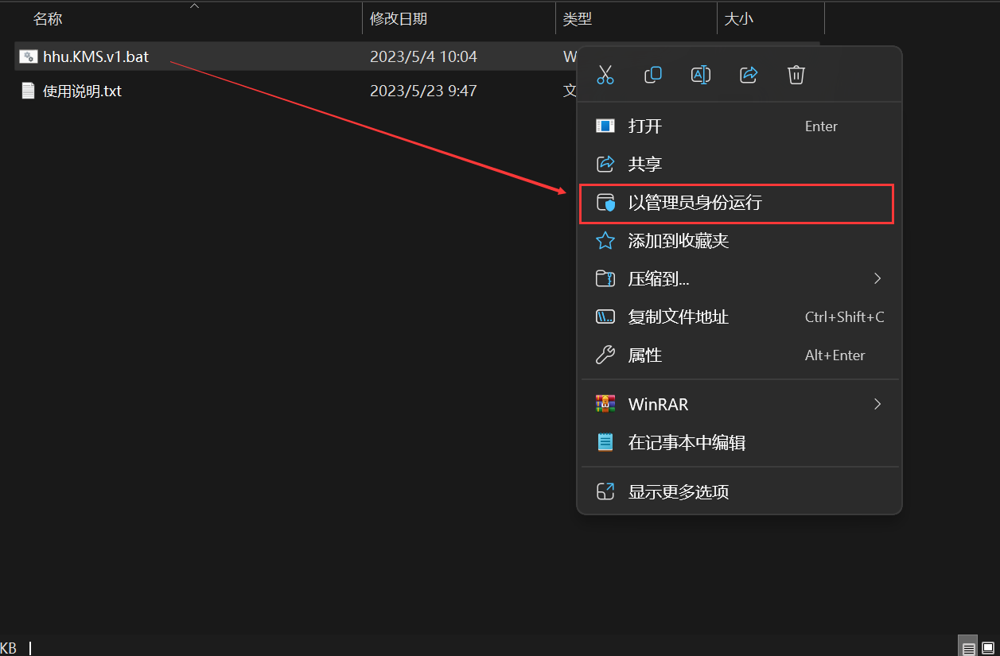

  * 输入对应的激活文件的号码 回车激活

     

  * 激活后的页面   --> 专业增强版

     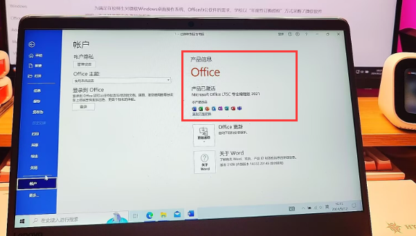 

  * 如果有一些报错信息 可以往下翻翻官网，自己看看文档哪里有问题 --- 最后附上版权声明

     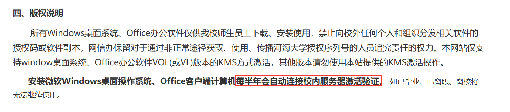

#### 校内的免费维修

当电脑有问题的时候可以去询问官方客服或者来找院科协或者校科协的义务维修群，里面有很多大佬热心的帮你解决问题，还有不定时有义务维修 清灰换硅脂 ~~不是打广告~~  

不紧急的话不建议去其他小店 ~~会被坑钱 大学生最喜欢爆金币了~~