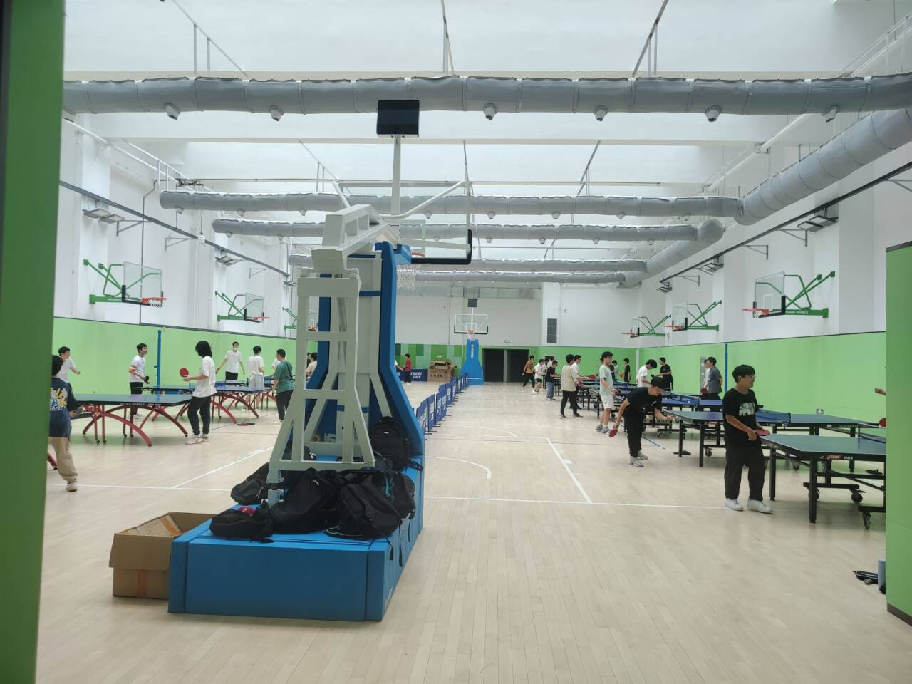

# 运动场馆

足球场与篮球场都是随意使用的,部分收费场馆参考:[河海大学场馆收费公示](https://zcc.hhu.edu.cn/2021/0106/c15113a218206/page.htm)

注意：部分场馆人数众多，且需要手动预约，例如羽毛球馆，需提前到门口大爷那里预约

# 健身房

## 金坛

金坛校区的健身房位于体育馆的二楼，设施较丰富，可以满足日常锻炼需求。
目前都是免费开放，但是需要提前预约。

## 江宁

江宁校区的健身房位于体育馆的一楼，设施破旧，没空调，加上收费，按进入时间段收5或10元

## 本部

待补充

# 乒乓球

## 金坛

金坛校区的乒乓球馆位于体育馆的一楼，设施较为完善，免费开放，但是需要提前预约。

## 江宁

江宁校区的乒乓球馆位于体育馆的一楼，按进入时间段收5或10元，收费阿姨比较凶。

## 本部

待补充

