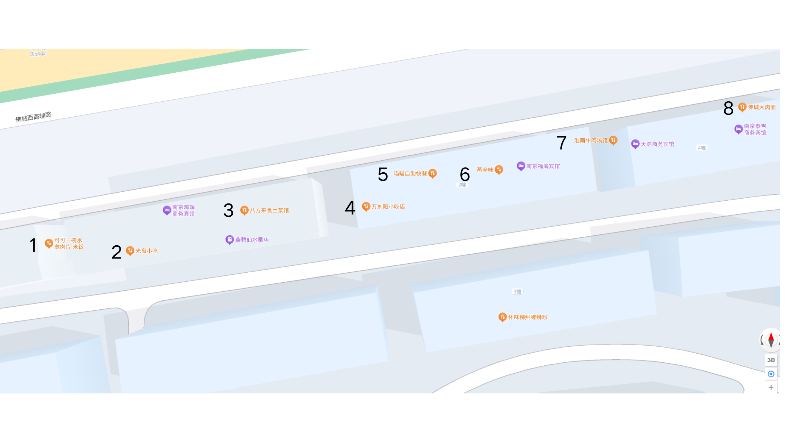

# 河海大学校外觅食指北

## 江宁校区

江宁校区的餐馆主要集中在南门

#### 南门对面菜市场

1. 板栗鸡米饭：神中神，炒饭量大好吃还便宜，盖浇饭可以自己加米饭。
2. 肥叔锅贴：待补充
3. 金陵瘦型鸭：待补充
4. 任家烤鸭店：待补充
5. 王家烤鸭店：待补充
6. 水西门瘦型鸭：待补充
7. 萍聚小馆：待补充
8. 宿迁擀面皮：待补充
9. 放心早点：待补充
10. 麻辣香锅：待补充
11. 淮南牛肉汤：待补充

值得一提的是这里的水果比较便宜，如果觉得学校的水果贵可以来这里买。

#### 南门往西

1. 水煮肉片：还行，建议点羊肉或者牛肉
2. 光盘小吃：待补充
3. 土菜馆：待补充
4. 万刘阳小吃店：待补充
5. 喵喵自助快餐：18一人，能吃饱但菜品数量少，味道也一般
6. 蒸全味：待补充
7. 淮南牛肉汤馆：待补充
8. 佛城大肉面：待补充

这里还有很多地图上没有但味道不错的餐馆

1. 重庆小面：汤面可以，但拌面一坨（字面意思的一坨，面都是坨住的），建议点汤面。
2. 古的螺蛳粉：味道很正宗，但小贵，20左右一人。

特别表扬京东便利店，有1元一根的小布丁，性价比直接干爆学校的雪糕。

#### 南门往东

1. 小蛮螺螺蛳粉：感觉不如古的螺蛳粉。
2. 川人川菜：伟大，无需多言。
3. 麦苏服兰州牛肉面：味道一般且小贵，如果想吃刀削面可以考虑
4. 华雷黄焖鸡：待补充
5. 味波日式料理：待补充
6. 西安面馆：biangbiang面和油泼面味道非常好，也是为数不多的宽面馆。
7. 我很芒：待补充
8. 仟百味食府：待补充
9. 傅纪正文：待补充

地图上没有的餐馆：

1. 华莱士：美团上两堡一卷和吉祥三堡性价比拉满
2. 九号地锅：待补充
